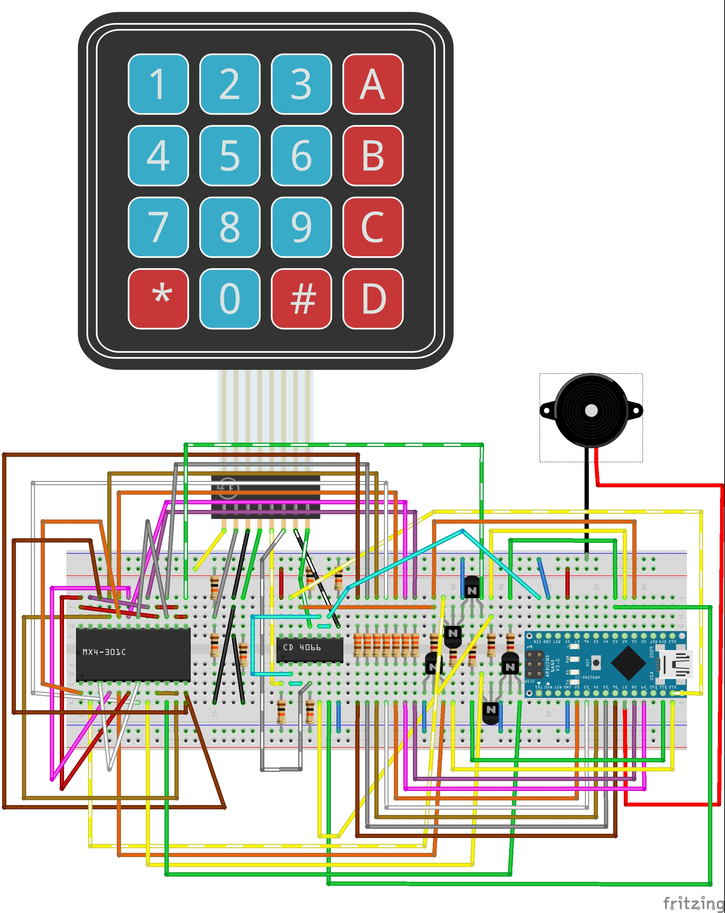

# NanoTimer
#### Timer with MX4-301 display, 16 keys keypad and Arduino Nano

Countdown / chronometer with 7 segments display for Arduino Nano

## Wiring

This is the schema using an Arduino Nano

You can also [download the Fritzing source](Schematics/BaseDisplay_Keypad_Buzzer.fzz)

## Software

Software is developed using [Microsoft Visual Code](https://code.visualstudio.com/)
and [Visual Studio Code extension for Arduino](https://marketplace.visualstudio.com/items?itemName=vsciot-vscode.vscode-arduino) on
a back-end [Arduino IDE 1.8.11](https://www.arduino.cc/en/Main/Software)

This environment create additional files and directories that can be ignored in the standard Arduino IDE.

Code documentation, generated with Doxygen, is available in the Documentation folder of the repository
or online at https://strawberryfield.github.io/NanoTimer/Documentation/html/index.html

## License and Disclaimer

copyright (c) 2020 Roberto Ceccarelli - Casasoft  
http://strawberryfield.altervista.org 
 
This is free software: 
you can redistribute it and/or modify it
under the terms of the GNU General Public License as published by
the Free Software Foundation, either version 3 of the License, or
(at your option) any later version.

This software is distributed in the hope that it will be useful,
but WITHOUT ANY WARRANTY; without even the implied warranty of
MERCHANTABILITY or FITNESS FOR A PARTICULAR PURPOSE.  
See the GNU General Public License for more details.

You should have received a copy of the GNU General Public License
along with these files.  
If not, see <http://www.gnu.org/licenses/>.